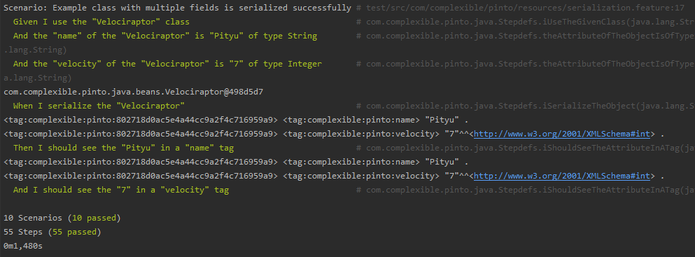

# BDD tesztelés Cucumber segítségével

## Megközelítés
A library csak unit tesztekkel rendelkezett, illetve egy aránylag korrekt leírást is készítettek hozzá a készítők. A BDD tesztelésnek némi utána olvasás után egyébként az lenne az egyik legfőbb lényege, hogy fejlesztés előtt kerülnek kitalálásra a scenario-k és ezek végig segítenek a fejlesztési folyamatban azzal, hogy ellenőrzik, hogy biztosan azok történnek egy adott rész/folyamat során, amiket a megrendelő/felhasználó látni szeretne (ahogy viselkednie kell az alkalmazásnak). Mivel ez egy kész lib, ezért nyilván erre most nem kerülhetett sor. Továbbá a readme tartalmaz egy olyan megjegyzést, hogy több felhasználási példáért a teszt fájlokat kell megnézni. Ezt nem tartom túl praktikus megközelítésnek, ezért arra gondoltam, hogy megpróbálok Cucumber segítségével olvasható teszteket készíteni, amelyek szövegesen írják le, hogy mire képes a lib. Mivel ez egy library, ezért akaratlanul is szembe találtam magamat reflexió használatával (pedig tényleg próbáltam elkerülni). A reflexió segítségével sikerült egy-egy feature-ben a scenario-k számát alacsonyan tartani (nem azért, mert lusta lettem volna sok steppet definiálni, hanem azért, mert nem láttam értelmét végtelen copy kódnak, amik 1-1 sorban térnek csak el).

##BDD tesztelés
A library fő funkciója a Java bean-ek szerializálása NTriple-ökbe, és az azokból történő deszerializáció. Ennek megfelelően külön feature fájlt szenteltem ennek a két viselkedésnek, illetve egy továbbit az annotációk (class, property, id) vizsgálatára. Az előző két esetben több, hasonló scenario megírásával kezdtem, amiket utána fokozatosan általánosítottam (ehhez kellett a reflection használata). A serializálás és a deszerializálás tehát működik bármilyen adott objektumra (a class fájlokat a bdddata mappába kell rakni), amely egyszerű String, Integer, Float vagy Boolean fieldekkel rendelkezik (a többi típusra nem láttam értelmét most megcsinálni az összes steppet, mert ezek is csak 1-1 sorban térnek el). Az annotációkhoz tartozó scenario-k olyan osztályokra működnek, ahol a tesztelni kívánt annotációk értékei már be vannak állítva, mivel ezek dinamikus váltogatását nem sikerült elérnem reflexió segítségével.

## A tesztelés során felmerült meglátások
*  Az RdfId annotációhoz köthető teszt készítése közben felfedeztem, hogy bár a library által használt hash függvény (ami amúgy deprecated) rendelkezik külön típusokra használható .put függvénnyel, ám a készítők minden field-et Stringként raknak bele a hash-elő függvénybe. Ez nekem nem volt egyértelmű, de részben azért, mert a hash függvény maga is deprecated, részben pedig azért, mert nagyon sok helyen eltörte volna a lib működését, végül nem javítottam ezt a viselkedést.
*  A readme-ben még egy régebbi OpenRdf API-hoz köthető osztály (Graph) volt feltűntetve a példa kódban, ezt javítottam a frissebb API által javasolt Model osztályra (a megírt tesztekben is ez szerepelt már, csak a readme-t nem frissítették).

